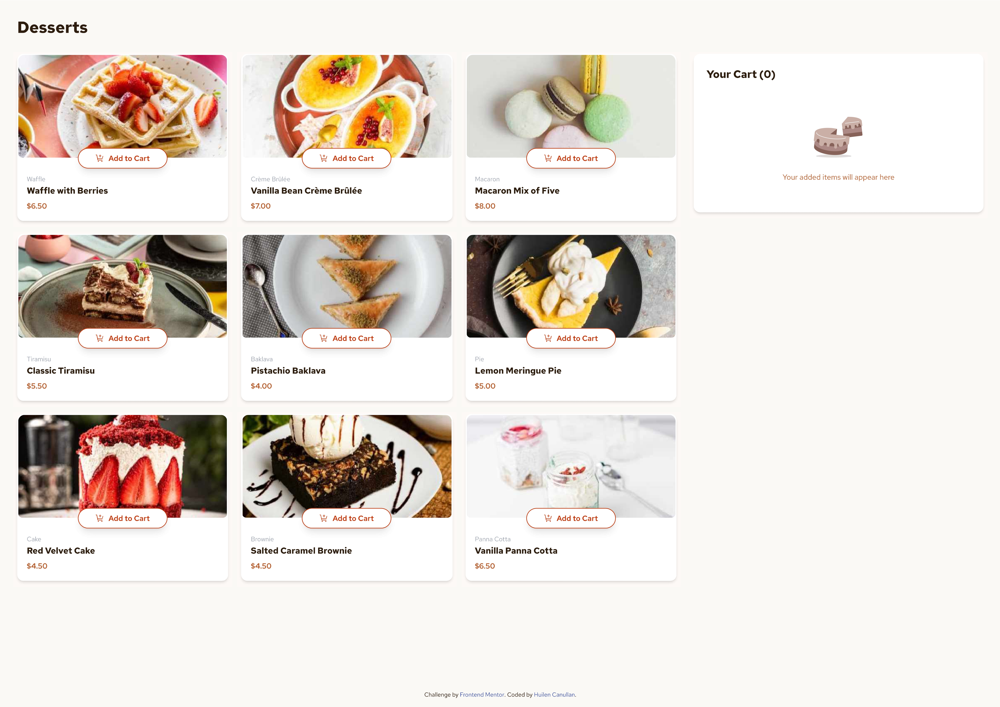
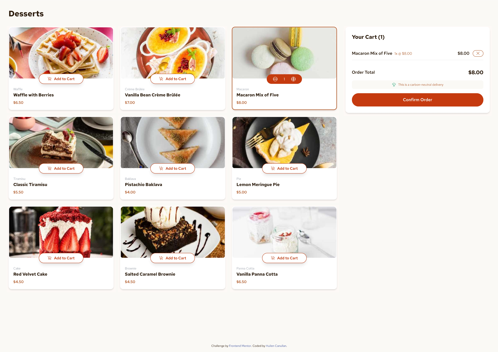

# Frontend Mentor - Product list with cart solution

This is a solution to the [Product list with cart challenge on Frontend Mentor](https://www.frontendmentor.io/challenges/product-list-with-cart-5MmqLVAp_d). Frontend Mentor challenges help you improve your coding skills by building realistic projects.

## Table of contents

- [Overview](#overview)
  - [The challenge](#the-challenge)
  - [Screenshot](#screenshot)
  - [Links](#links)
- [My process](#my-process)
  - [Built with](#built-with)
  - [What I learned](#what-i-learned)
  - [Continued development](#continued-development)
  - [Useful resources](#useful-resources)
- [Author](#author)

## Overview

### The challenge

Users should be able to:

- ✅ Add items to the cart and remove them
- ✅ Increase/decrease the number of items in the cart
- ✅ See an order confirmation modal when they click "Confirm Order"
- ✅ Reset their selections when they click "Start New Order"
- ✅ View the optimal layout for the interface depending on their device's screen size
- ✅ See hover and focus states for all interactive elements on the page

### Screenshots




### Links

- Solution URL: [Frontend Mentor Solution](https://www.frontendmentor.io/solutions/product-list-with-cart-using-react-vite-jsx-and-tailwind-rMsR25Pd44)
- Live Site URL: [Vercel URL](https://product-list-with-cart-gray.vercel.app/)

## My process

### Built with

- **React** - JavaScript library for building user interfaces
- **Vite** - Build tool and development server
- **Tailwind CSS** - Utility-first CSS framework
- **CSS Grid & Flexbox** - For responsive layouts
- **Mobile-first workflow** - Responsive design approach
- **Semantic HTML5** - Accessible markup
- **CSS custom properties** - For consistent theming

### What I learned

This project was an excellent opportunity to practice several key concepts:

**State Management with React Hooks:**

```jsx
const [cartItems, setCartItems] = useState([]);
const [itemQuantities, setItemQuantities] = useState({});
const [showOrderModal, setShowOrderModal] = useState(false);
```

**Component Architecture:**

- Created reusable components like `ProductCard`, `Cart`, and `AddToCartButton`
- Implemented proper prop drilling for state management
- Built a modal component for order confirmation

**Responsive Design:**

```css
/* Mobile-first approach */
.grid-cols-1 lg:grid-cols-3
.flex-col lg:flex-row
```

**Tailwind CSS Integration:**

- Custom color palette using HSL values from the design system
- Responsive utilities for different screen sizes
- Custom font family configuration

**Interactive Features:**

- Quantity controls with increment/decrement functionality
- Cart item management (add, remove, update quantities)
- Modal implementation for order confirmation
- Hover and focus states for all interactive elements

### Continued development

Areas I'd like to focus on in future projects:

- **Advanced State Management**: Implement Redux or Zustand for more complex state
- **TypeScript**: Add type safety to React components
- **Testing**: Implement unit and integration tests
- **Performance Optimization**: Code splitting and lazy loading
- **Accessibility**: Enhanced ARIA labels and keyboard navigation
- **Animation**: Add smooth transitions and micro-interactions

### Useful resources

- [React Documentation](https://react.dev/) - Official React docs for hooks and components
- [Tailwind CSS Documentation](https://tailwindcss.com/docs) - Utility-first CSS framework
- [Frontend Mentor](https://www.frontendmentor.io/) - Real-world coding challenges
- [CSS Grid Guide](https://css-tricks.com/snippets/css/complete-guide-grid/) - Comprehensive CSS Grid reference
- [Flexbox Guide](https://css-tricks.com/snippets/css/a-guide-to-flexbox/) - Complete Flexbox reference

## Author

- Frontend Mentor - [@huicanu](https://www.frontendmentor.io/profile/huilenc)
- Twitter - [@huicanu](https://www.twitter.com/huicanu)
- GitHub - [@huilenc](https://www.github.com/huilenc)

---

## Getting Started

### Prerequisites

- Node.js (version 16 or higher)
- npm or yarn

### Installation

1. Clone the repository:

```bash
git clone https://github.com/huilenc/product-list-with-cart.git
cd product-list-with-cart
```

2. Install dependencies:

```bash
npm install
```

3. Start the development server:

```bash
npm run dev
```

4. Open [http://localhost:5173](http://localhost:5173) in your browser

### Building for Production

```bash
npm run build
```

### Deployment

This project can be easily deployed to:

- **Vercel**: Connect your GitHub repository and deploy automatically
- **Netlify**: Drag and drop the `dist` folder or connect your repository
- **GitHub Pages**: Use the `gh-pages` package

## Features

- 🛒 **Shopping Cart**: Add, remove, and manage items
- 📱 **Responsive Design**: Works on desktop, tablet, and mobile
- 🎨 **Modern UI**: Clean, accessible design with hover states
- ⚡ **Fast Performance**: Built with Vite for optimal speed
- 🎯 **User Experience**: Intuitive interface with clear feedback
